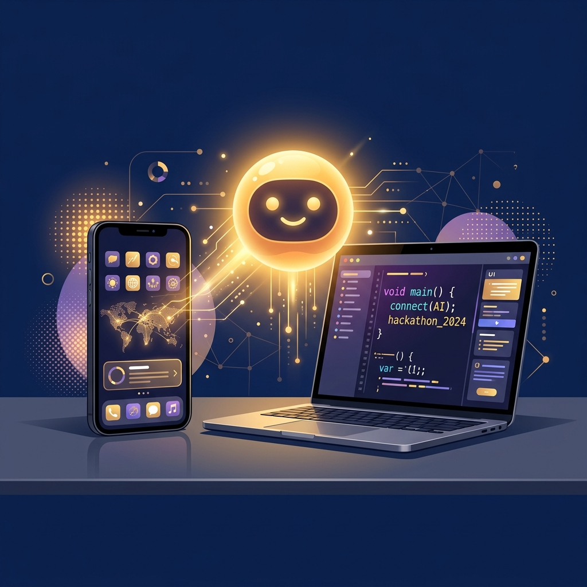

# NaviAge AI
**Technology Made Simple & Friendly**

 <!-- Note: Replace with actual screenshot -->

## Project Overview
**NaviAge AI** is a comprehensive, accessibility-first web application designed to help senior citizens navigate technology with confidence. This project directly addresses the digital divide by offering an AI-powered assistant, interactive tutorials, and a safe scam-detection training environment.

The project requires zero installations, running directly in any web browser with extremely large touch targets, high contrast modes, and simplified navigation.

## Key Features

1. **AI Tech Assistant (Gemini API Integration)**
   - Conversational AI powered by Google Gemini.
   - Pre-programmed with a specific "Senior Persona" system prompt: *avoids jargon, explains step-by-step, uses analogies, and maintains patience.*
   - Supports Voice Input dictation (Web Speech API) and Text-to-Speech answer readback.
2. **Interactive Tech Tutorials**
   - Step-by-step visual guides customized by device (Phone, Tablet, Computer).
   - Tracks progress and offers simple, one-sentence instructions.
   - Covers: Video calling, sending photos, Google Maps, connecting to WiFi, etc.
3. **Scam Detection Trainer**
   - Real-world scam scenarios designed as a safe, risk-free quiz.
   - Points out "Red Flags" safely when a mistake is made.
   - **AI Scam Checker:** Seniors can paste any suspicious message (email/text) to get an immediate, easy-to-read safety verdict generated by Gemini AI.
4. **Quick Help SOS Cards**
   - 3-step offline emergency resolutions for common tech hurdles ("My screen is frozen", "No sound", "Device is acting up").
5. **Accessibility-First Design System**
   - WCAG AAA Compliant contrast minimums and scalable fonts.
   - Maximum legible font scale controls (up to 1.5x scaling without layout breaking).
   - "Reduced Motion" and "High Contrast Mode" toggles built directly into settings.
   - Minimum 56px touch target sizes for unsteady hands.

## Technology Stack
*We opted against heavy frameworks (React/Next) to ensure lightning-fast loads on older devices often used by senior citizens, focusing instead on pure, vanilla excellence.*

- **Structure**: Semantic HTML5
- **Styling**: Vanilla CSS (Custom properties, Flexbox/Grid, Senior-specific Design System)
- **Logic**: Vanilla JavaScript (ES6+ Modules)
- **AI Integration**: Google Gemini API
- **Accessibility APIs**: Web Speech API (Dictation + Speech Synthesis)
- **Hosting**: Ready for Vercel/Netlify

## How to Run Locally

You don't need any complex build steps. To run this project:
1. Clone this repository or download the ZIP.
2. Open the project folder.
3. Simply double-click `index.html` to open it in your browser!
4. *(Optional)* Go to the Settings page and enter your Google AI Studio API key to enable the Chat assistant.

## Deployment

Since this project consists of pure HTML/CSS/JS, it can be deployed easily to any static hosting provider.
1. Log into your Vercel or Netlify dashboard.
2. Drag and drop the project folder onto the "Deploy" window.
3. Your application is instantly live globally.
